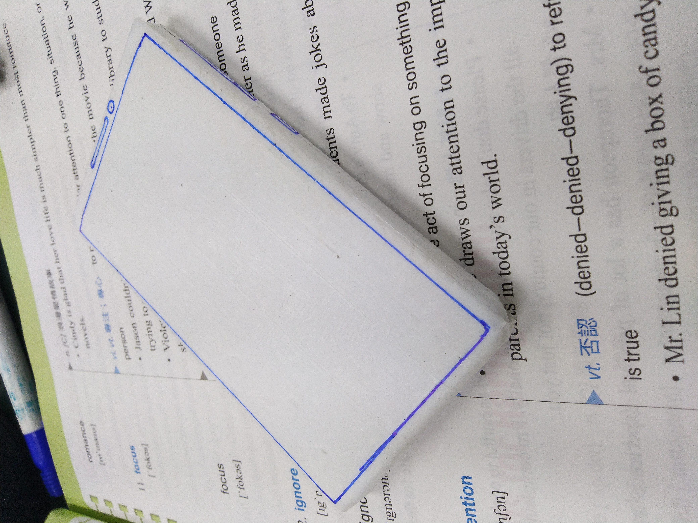
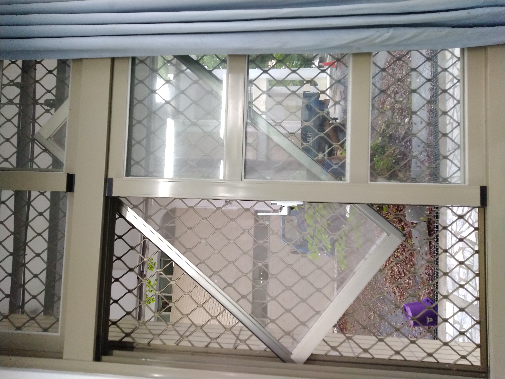
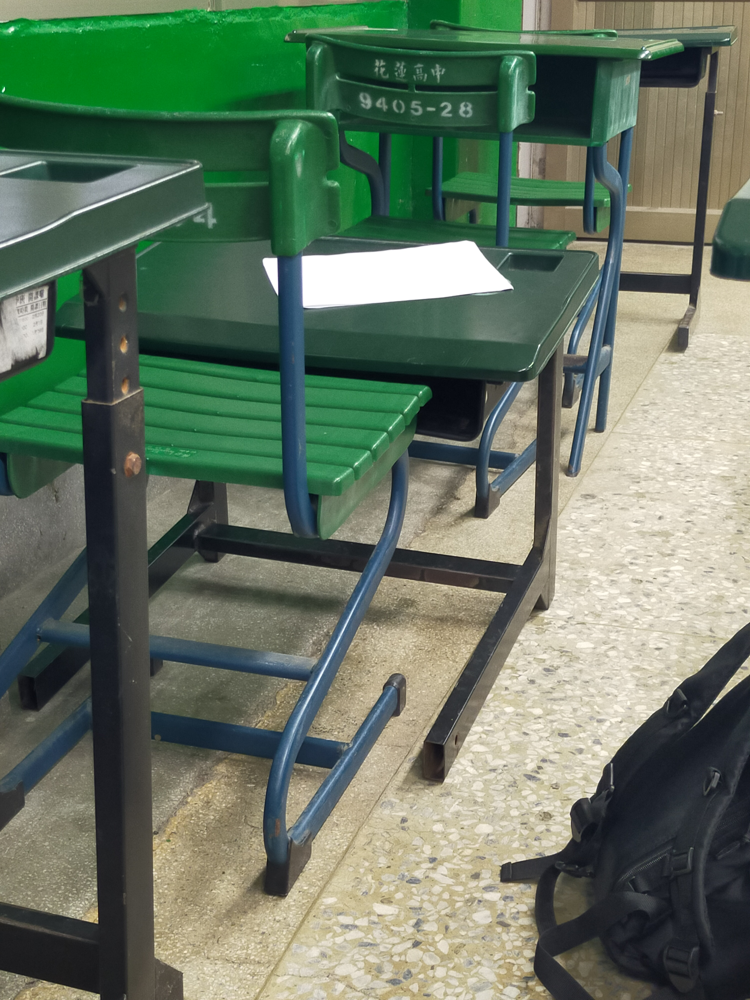

# SchoolComputerAutoRestoreCrack
適用於學校的破爛電腦

若學校有新的還原軟體希望之後的學弟也把方法開開源

使學校的電腦處於最安全的狀態

學校電腦總是自動還原使我們的傑作消失，我很討厭這點，因此我打算破解它

且在使用時可能會當機，甚至開不了機，需要用腳踹和摔的方式進行物理修復

方法

(暴力破解)

找出學校用的還原軟體

若不是裝上ToolwizTimeFreeze軟體的電腦請轉彎

找出配置文件

將TOOLWIZTIMEFREEZE.CONFIG文件複製到隨身碟的某資料夾

(假設為 F:\tmp)

C:

dir /a

cd C:\TOOLWIZTIMEFREEZE\

del /a TOOLWIZTIMEFREEZE.CONFIG

copy F:\TMP\TOOLWIZTIMEFREEZE.CONFIG

註:密碼是"123"，原配置文件需刪除才能進行複製，不然會出現"存取被拒"

test with HLHS PC

# 高一時幹過的好事

## 手機殼 09/16/22

那時要收手機，我把牆上的電線和保護罩拆起並疊合，成為"假機"

  
   

## 平行四邊形窗戶 11/07/22

因為班上的貓弄過，因此模仿並測試其靜力平衡，班導還以為窗戶廢了要報修

  
   

## BadBoard 01/16/23

圖釘可以組字，但不限於英文

  
   

## 電化講桌控制器位移 03/16/23

把控制器變成可移動並隨身攜帶

  
   

## 集體當機 04/02/23

花蓮學做完作品太無聊而順便開搞，順便拔同學主機的電源

  
   

## 爆改桌面 12/03/23

因固定桌子的螺絲生鏽，變成手擰螺絲，加上桌腳是用同一個鐵管做成，就進行桌腳翻轉

  
   

